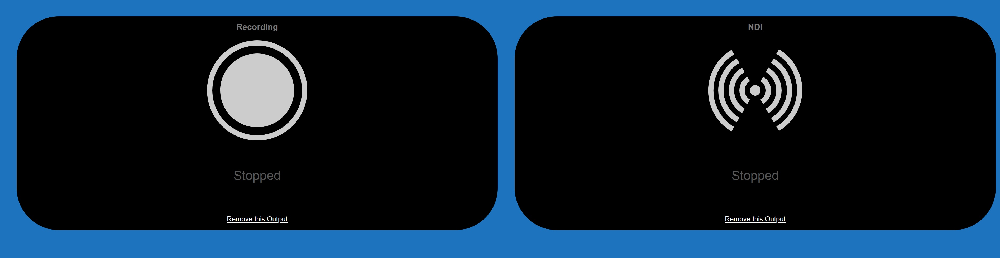

# Xsplitter
APK version of the webui of streaming remote by fredemmott

This is simply the webui from streaming remote but converted into an android app.
I have re-labelled some things inside which may confuse the average user and edited the colours and layout slightly to be a bit more pleasent on the eyes.

I designed this app for ease of use and if you don't wish to install it to your phone
you can download just the source files and and run them in a web browser

this app requires no special permissions or access to your phone but you will have to enable "install from unknown resource" on your phone

to use the dependencies needed to work with OBS or Xsplit please visit this link below
https://github.com/fredemmott/streaming-remote

and read this

https://github.com/fredemmott/streaming-remote/blob/v2.2.4/INSTALL.md

